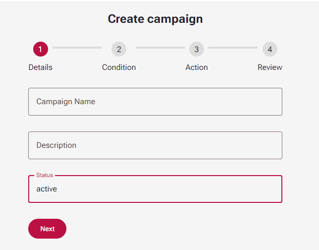

# Campaigns to send ERC-20 tokens

Organizations can use campaigns to send fixed amount of tokens for pre-defined actions.

If need to send floating amount, you can use [sending ERC-20 tokens directly](sending-erc-20-tokens-directly.md)

## Create campaign

To create campaign visit this [page](https://nuqtah.io/console/campaigns/create)

<figure><figcaption>
Create campaign step 1
</figcaption></figure>

Fill out first form, enter name of campaign (for example "Sign in reward"), enter campaign description if needed and keep status active if u want campaign to be active after creation.

## <mark style="color:red;">Need to remove usless fields from forms</mark>&#x20;

## Campaign usage

After creating campaign you can use it via API call.

First you need to [create API key](../redeem-api/getting-started.md#generate-an-api-key).

Now you can use that endpoint to send reward to  user by email&#x20;



This endpoint will send rewards for campaign to user account by email.



apiKey ${NUQTAH\_API\_KEY}



email of account who will get reward



{ "data":&#x20;

&#x20;  {

&#x20;       "campaignReward":{\*reward object\*},&#x20;

&#x20;       "tx": \*transaction hash : String\*

&#x20;   }

&#x20;}


